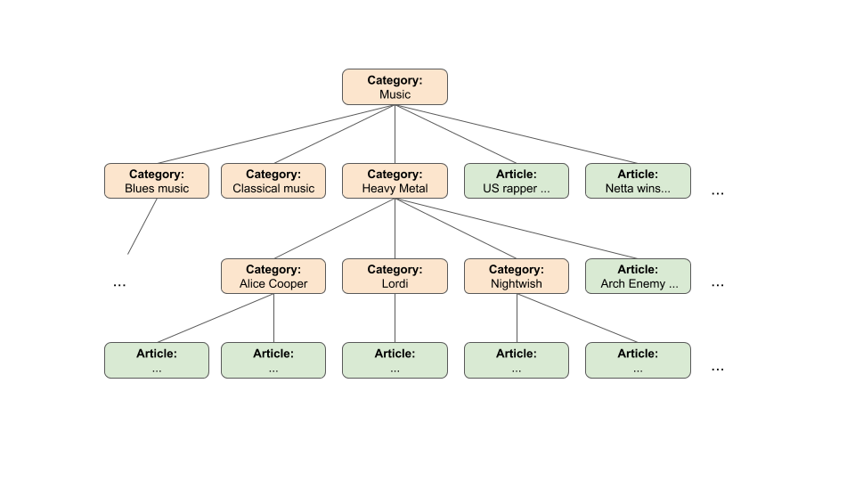
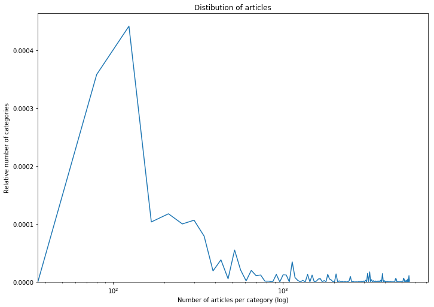
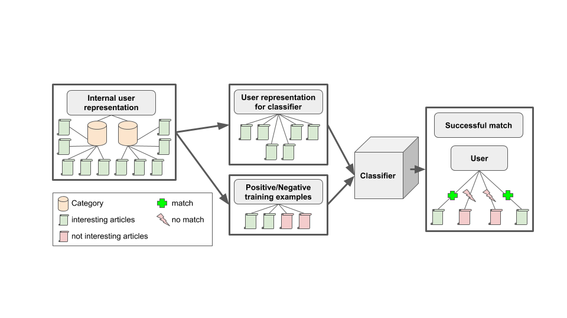

# ML4NLP - Gamma

## Introduction (Week 1)
News recommendation is a commonly tackled task in natural language processing. In our era of massive sources of information available, the appropriate pre-selection of candidates matching the specific interest of a user is a crucial task. Both the user and the providing platform profits from such a system, as users whose needs are fulfilled may stay longer in such an environment. Given its purpose, news recommendation may be seen as an instance of classical Recommender System. According to Ricci et al. (2010), such a system is composed out of three basic components:

- User: A user is an entity having an interest in consuming items given its special preferences.
- Item: A product is an entity from a set, which is chosen by the system for best matching the preferences of a user. In our case, these items are news articles.
- Preferences: A preference is a feeling of a user regarding an item, commonly described as likes and dislikes.

Many current websites use such systems for different modalities. Examples are the selling of products (i.e. Amazon), the recommendation of movies and series (i.e. Netflix) or the providing of somewhat pleasant, interesting or funny posting (i.e. Facebook).

### Project goal
The goal of this project is to implement a news recommendation system based on articles of the free-content news source Wikinews (https://www.wikinews.org/). As the data base we will use KnowledgeStore (https://knowledgestore.fbk.eu/), in which entities and events from Wikinews have been extracted and which is enriched with knowledge from dbpedia (https://wiki.dbpedia.org/). 

With the help of SPARQL (https://www.w3.org/TR/rdf-sparql-query/) and the KnowledgeStore API (http://knowledgestore2.fbk.eu/nwr/wikinews/ui) we will access and extract knowledge from this data base to easily gather the data for our news recommendation system in a computer readable format.

### General approaches
In order to understand the design decisions of our project, we sill shortly introduce the main idea of popular approaches for Recommender Systems. In generel two popular approaches can be distinguished. A list of recommendations can be gathered either by
applying collaborative filtering or by applying content-based filtering.

In the collaborative filtering approach, recommendations are selected by collecting and comparing information and preferences from multiple users. The underlying assumption is that if a person A has the same interest as a person B, the person A is more likely to have person B's interests than that of a randomly chosen person. Pure collaborative filtering approaches do not exploit or require any knowledge about the items themselves. An advantage of this strategy is that these data do not have to be entered into the system or maintained.

In the content-based filtering approach, the descriptive attributes of items are used to make recommendations. The goal is to recommend items to the user that are similar to those that a user liked in the past. So at its core, content-based filtering is based on the availability of (manually created or automatically extracted) item descriptions and a profile that assigns importance to these characteristics. An Advantage of this approach is that it does not require large user groups to achieve reasonable recommendation accuracy. Moreover, new items can be immediately recommended once item attributes are available. In some domains these item descriptions can be automatically extracted or are already available in an electronic catalog. In other domains some of these characteristics are hard to acquire automatically. In that case such information must be manually entered into the system.

Both approaches can be combined into a hybrid approach, which then could be more effective in some cases. But due to a lack of user information, we would have to enter all the user data manually to use elements of a collaborative filtering approach. Given the established rules of statictics and data science, a tremendous amount of fake data would be needed for finding such intrinsic relations. As an alternative, in the content-based filtering approach, we can use SPARQL to extract automatically the pre-annotated characteristics of our news articles. Only the preferences of the user have to be simulated from us manually.

### Classifier design
Given the complexity of the task, we decided to stick to the content-based filtering approach in the beginning. In order of implementing such a news recommendation system utilized supervised machine learning, we have to define our goals. In a nutshell, we define our task as approximating an unknown function *f*, which gets the preferences of a user and an article as input and returns a score indicating the predicted interest of the user for that article. Iterating through the set of news articles and evaluating the function multiple times, such an implementation would find the most relevant articles from a corpus.  

For acquiring the required data, we have to simulate some user with specific preferences. This data will be utilized both as training and testing data. In a next step, the viewed articles will be used to extract a representation for the preferences. This preferences will afterward be used to train the second classifier mentioned above.

## Dataset (Week 2)

Given the aims of the project and its design as a supervised classification task, the data as input is a crucial part of the system. In the case of a recommendation task, the preferences of the user may be considered as the significant information. In general, we might have two different ways of representing it, independently if we want to focus on collaborative or content-based approaches mentioned above:
- In a "direct measurement", we measure the preferences of the users by asking for their opinion towards the items. The actual modalities of this process are not specified. Therefore, we may use setups like binary like-dislike questions or grading scales. While the direct communication and instruction with the participants may result in high-quality data, the approach scales not well. The users may have to spend their time actively and need therefore to be recruited.
- "Indirect measurements" take an alternative approach: By observing the behavior of users in their normal environment, one may be able to draw some conclusions. Especial in the contexts of popular websites, that is a commonly utilized approach. By using indicators like duration of stay or interacting behavior, the preference of a visitor may be concluded. Such an approach scales extremely well with the number of users who may not even recognize they are currently tracked. On the other side, such an approach adds a tremendous amount of noise due to its uncontrolled nature: A user may abort reading a newsletter article because she or he is distracted or his or her current mood does not match his or her general preferences.

Both approaches have advantages and disadvantages which have to be considered during the plan of the experiments. Like commonly in data science, it is a classical weighing between small amounts of high-quality and colossal amounts of rather noisy data where both may come from a specific distribution. In this project, we will stick to the firstly formulated type of measurement due to different reasons. First of all, we have no access to an existing news website as a potential source of user data. Especial under the influence of modern data protection laws, a collection of extensive amounts of data seems not to be possible. Without having to care about the intrinsic noise of the data, one may focus more precisely on the actual goal of the experiment. In order of acquiring high-quality data, we stick therefore to explicitly annotated preferences. As the topics of interest will be rather high level in our setup, we have even the opportunity to utilize artificially generated data. Given broad and mutable exclusive categories of interest, we may simulate "ideal" user.

In order of encoding the preference in our setup, two different ways of a binary code seem reasonable. On the one hand, we may annotate both "likes" and "dislikes" regarding a set of articles. On the other hand, we may create exclusively a set only with articles of interest and considering everything outside as "not of further interest". As it may simplify later the introduction of noise while keeping the data management simple, we will stick to latter way.

Summarizing these design decisions, we utilize a hybrid approach by combining a pre-existing set of newspaper articles with artificial users with "expert-made" yet idealized preferences:

1. A collection of mutable exclusive topics of newspaper articles is defined by human experts (i.e. "Porsche car", "Mid-elections in the US").
2. Human experts assign a number of newspaper articles to each topic.
3. A massive amount of artificial users are generated by assigning different topics of interests to them. 
4. During training, a subset of the articles of each category is randomly selected and trained to result in a match regarding another article of the category. Furthermore, newspaper articles from other categories are utilized to train the binary classifier regarding a negative response.
5. For evaluation purposes, articles of each category not used in training are evaluating if being correctly classified.

This approach allows covering a large number of desirable properties of a dataset. Due to its artificial nature, a large amount of data can be generated effortlessly. The quality of the data is sound while being clearly documented. Probably, the biggest source of potential trouble is the representative nature of the data regarding the "real world". A careful selection of an extensive set of appropriate topics with assigned newspaper articles is necessary.

## Source of the dataset (Week 3)
After defining the general approach, the next step consists of evaluating which kind of dataset might be suitable for the proposed method. We need to define the exact source for our samples. Our first starting points were the annotated samples provided by the KnowledgeStore. Nevertheless, given its publication date and the commonly rather rapid development of popular web pages, we decided, that it might be worth trying to obtain more samples as the annotated ones by accessing Wikinews directly. 

Wikinews differentiates between categories and articles. One category can have zero, one or multiple subcategories. The subcategories are normal categories as well and can have zero, one or multiple subcategories on their own again. An article can be assigned to every category. Every category may have multiple subcategories and articles assigned simultaneously. The category "Music", for example, has both the subcategories "Blues music", "Classical music", "Heavy metal" etc. but also multiple articles, e. g. "US rapper Mac Miller dies at home in Los Angeles" or "Netta wins Eurovision Song Contest for Israel" assigned. Given this hierarchical structure, a representation as a tree-like structure seems suitable to represent the data.



For querying all the actual data, two ways seemed possible and were evaluated. The foundation for all our experiments was an object-orientated pipeline written in Python allowing a flexible parsing, filtering and storing of both categories and articles. The classes may be found in the file "ArticlesExtractor.ipynb".

- As a first approach, Wikinews offers its own page, where every category and the number of assigned news articles to each category are listed (https://en.wikinews.org/wiki/Special:Categories). Unlike one may expect, this page is automatically generated by the underlying MediaWiki-System. As an implication,  the list contains not only categories but also a high amount of noise: The pages of specific users and authors are included beside "Meta-categories" like "Corrected Articles" or "Templates".  Besides the actual parsing, a high amount of work was employed to define filters for such outliers. Utilizing more than 30 different regular expressions both for categories and articles, we defined a rather stable subset of valid entities. Nevertheless, fearing pollution and a drop in quality we do not follow this approach. 

- As a second approach, we defined a set of "top-level" categories and created the structure recursively from those. We oriented us both on the categories proposed by Wikinews and the one embedded into the KnowledgeStore. As these pages do not include any metadata, we do not apply any additional filtering.

Despite our effort, the extraction process does not lead to a potentially valuable amount of additional data. In comparison to the 19737 annotated articles in the KnowledgeStore, the 27657 articles available nowadays were not considered as justifying a complete hybrid pipeline of both sources, at least not during our first experiments. We will stick to the available categories in the KnowledgeStore in order of generating the preferences of our user.

## Generating the dataset (Week 4)

### Preprocessing
After we spent some time on the analysis of the articles and categories provided by WikiNews and the Knowledgestore during the last week, we implemented the necessary steps to generate our dataset for the classifier in this week.

As a first step, we extracted the URL of every article existing in the Knowledgestore. Given the identifier of all the 19737 articles stored there, the object-orientated structures developed in the last week were utilized to enrich them with additional information. Utilizing the API of the underlying software *MediaWiki* and a JSON parser, we extracted both the human readable title and the list of matching categories. Despite our multiprocess-based parallel parsing pipeline, this enrichment took a significant amount of time. In order of simplifying the development and using the available resources in a fair manner, these data was cached locally in the file *articles.pickle*.

In the next step, we optimized the data layout of these articles regarding the following tasks. Utilizing a dictionary-like structure, a mapping of all available categories towards their included articles were generated. Under usage of the hashing functionality of Python we ensured that the same category is not saved multiple times while still having access towards an easy iterating, filtering and mapping of the data. In total, we obtained 5833 different categories with all the available articles. 

As already described in the previous week, the resulting categories do not all represent information of further interest. Especially categories like  "Corrected Articles" or "Audio reports" do not make any sense for a news recommendation system. Utilized all the hand-designed regular expressions, the already obtained categories where therefore filtered in a third step.


By inspecting the 2408 remaining categories with the most influential ones visualized above, we were able to ensure the correctness of our approach. Still, we did not defined our lower required border for the importance of a news category. Small categories might carry no information of representative nature and do not allow an efficient training procedure due to their small amount of articles. In the next step, we analyzed therefore the distribution for figuring out, how many articles should be enforced for a valid category.



Given the sufficient amount of categories with a rather high amount of categories, we saw no special need to face the problems resulting from tiny categories and decided to filter out every category with less than five articles. Finally, the resulting number of obtained categories used from now on is therefore 1612.

### Generate dataset
Interpreting these categories as potential interests of a news readers, the implementation of the pipeline for the actual generation of training data is rather straightforward. Fundamentally, every user is an instance of the class *User* with a specific amount of different interests. From each of these users, multiple user representations might be randomly drawn. These representations consists out of a list of articles considered as interesting for the user and are utilized as the first part of input to the classifier. The second part if the input is a single articles, which the classifier has to classify as "interesting"  or "not interesting" finally. In order to generate such positive and negative samples, the class *User* supports methods for getting articles with one of these known binary labels. A set-theoretically inspired implementation ensures that subcategories are handled in a correct manner when drawing negative samples. 



Finally, we are now able to generate positive or negative labeled training data for individual user. The fundamental idea behind training is to generate a enormous amount of users, probably even on-the-fly, during our training process and train our classifier on their representations. Due to the combinatorics of assigning random articles to users, we can generate an incredible amount of training data. For validation purposes, we might utilize a subset of users with interests not used during training. Below, you find an example representation generated by the system for an user with interests in Dubai and Nicola Sturgeon:

```
Example user representation (Interests: Dubai, Nicola Sturgeon):
			 "Emaar Properties claims Burj Dubai as world's tallest building"
			 "Elderly man in Scotland dies after contracting H1N1 swine flu virus"
			 "Dubai purchases RMS Queen Elizabeth 2 for $100 million"
			 "40th H1N1 swine flu death recorded in Scotland"
			 "SNP wins Glasgow East by-election in Scotland"
			 "Two charged in Heathrow bomb threat"
			 
Interesting:
			"George Bush arrives in Saudi Arabia as part of his Middle East visit"

Not interesting:
			"U.S. Senator Larry Craig to resign"
```

## Finalize the dataset (Week 5)

Last week we implemented the single functions to generate our dataset. What was still missing are functions, that completely generate our training and testing dataset in one run. Moreover, we want to save the generated dataset locally in a pickle-file. This is a necessary task to document our dataset and with it, we are allowing to be able to access it later and to recognize, on which data our classifier was trained.

### Setup (How to ...)
This week it was asked, whether we can include a little part on the setup of our codebase in our documentation. In the whole project, we will use Python 3 as our programming language (https://www.python.org/). Our plan is to first use IPython Jupyter Notebooks  (http://jupyter.org/) for a quick prototype and for a first implementation and visualization of our ideas (file ending is ".ipynb"). After testing our prototypical implementations and splitting up the code into modular parts, we then extract them into normal Python-Files (file ending is "py"). These Python-Files can then be easily accessed by our IPython Jupyter Notebooks or by other Python-Files.

In order to run the code, you have to install Python 3 on your local computer. We recommend installing Python 3 via Anaconda. You can download Anaconda here: https://www.anaconda.com/download/. In order to install Anaconda, please follow the guidelines on this website: https://conda.io/docs/user-guide/index.html.

Furthermore, we recommend using different Anaconda environments for different projects (more information on this website: https://conda.io/docs/user-guide/tasks/manage-environments.html). After you have installed Anaconda (and Python 3 with it), you are now ready to run the Python files in your terminal (just type "python" and then your desired Python file to execute in the command line). Alternatively, you can use different Integrated Development Environments (IDE) to run the Python files(https://wiki.python.org/moin/IntegratedDevelopmentEnvironments).

In order to run and look into the code of the IPython Jupyter Notebooks, you have to install Jupyter Notebook on your local computer. Luckily, if you have installed Python 3 via Anaconda, you already should have Jupyter Notebook installed. Nonetheless, if you use different Anaconda environments, you should install it for your corresponding environment as well. For installing it in a certain environment just open the command line, activate your environment and type in: "conda install jupyter". You can run Jupyter Notebook by typing in "jupyter notebook" in your command line. Then your browser should open and you can choose the IPython Jupyter Notebook file, you want to open in the browser.

### Possible Hyperparameters
This week, we thought about the hyperparameters that can be tuned to generate the dataset and to feet the dataset into the classifier. With tuning these hyperparameters we are able to generate different kinds of datasets and therefore we can explore, which dataset and which training hyperparameters will improve our classification accuracy in the future. The possible hyperparameters are:

- number of articles in the user representation (depends on the minimum number of categories)

- number of interests (categories) of one user (could be flexible or a fixed amount of categories for each user)

- number of internal users

- number of user representations per user

- "Batch-size": number of positive and negative labels per user presentation

- splitting categories in training and test dataset (do they have the same categories or different ones?)

### Restructuring the code
Due to these hyperparameters and for an efficient way to create our dataset, we thought it is perhaps a good idea to restructure the code a little bit. 

For the user representation that we feed into our classifier, we created the class Representation. This class takes in the parameters number articles per category, the number of positive samples and number of negative samples. In the next step, we created a User class. This class represents our internal user. It can be controlled by the parameters number of interests, number of representations and all the parameters of the representation class. Finally, we implemented a Dataset class, which is responsible for generating the data set (and in the future for saving it in a pickle- or csv-file). The Dataset class gets the parameters number of user and all the parameters of the User class.

To handle all hyperparameters in an efficient and central way, we created for each class the subclass Parameter. This allows us to reuse the parameters and fed them into our three different classes efficiently.

This is an example for a dataset with the hyperparameters articles_per_interest = 1, positive_samples = 3, negative_samples = 1, representations = 1, interests = 2, users = 1:

| interest 1   | interest 2   |article_interested 1         |article_interested 2               |candidate                    |label|
|--------------|--------------|-----------------------------|-----------------------------------|-----------------------------|-----|
|Baltic Sea    |Sony          |Aggressive Bird Flu found ...|American console sales continue ...|Warming oceans make it ...   |True |
|Baltic Sea    |Sony          |Aggressive Bird Flu found ...|American console sales continue ...|Snow causes German ...       |True |
|Baltic Sea    |Sony          |Aggressive Bird Flu found ...|American console sales continue ...|Sony's Playstation ...       |True |
|Baltic Sea    |Sony          |Aggressive Bird Flu found ...|American console sales continue ...|University defeat Maro ...   |False|

Finally, we are now able to create a list, which contains the internal categories (interests) of a user, the user representation for the classifier and the labeled examples in one row. As mentioned above, we want to save this generated dataset in a pickle-file, so that further researchers can just read it in into their code. We did not implement this yet, because we are not sure, which data is exactly necessary to save in order to split it into a training and a test dataset. But after we know more about our training and test data split and about our classifier, we will surely implement this.

### Citations
Aggarwal. (2016). Recommender Systems: The Textbook. Springer

Jannach, Zanker, Felfernig, Friedrich. (2011). Recommender Systems: An Introduction. Cambridge University Press

Ricci, Francesco & Rokach, Lior & Shapira, Bracha. (2010). Recommender Systems Handbook. Springer
